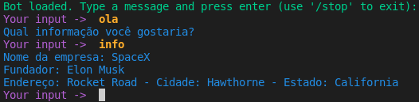

# Avaliação Sprint 4 - Projeto ChatBot usando RASA

## 📜 Descrição do Projeto
Projeto avaliativo da Compasso-UOL, que possui o intuito de avaliar e pontuar:

- Com base no trabalho da primeira Sprint (https://github.com/daniel-compasso/avaliacao-sprint-1), crie um chatbot para consulta às informações disponibilizadas no banco de dados MongoDB. Caso o trabalho já seja voltado a questões, 
- Ao iniciar o bot, obtenha os dados da api e grave no banco;
- Os dados solicitados durante o uso do bot devem ser consultados partir do MongoDB;
- O bot deve ser implementado em Rasa e deve usar o Spacy em Português;
- Devem ser utilizados os recursos de formulário e entidade no bot;
- O bot deve estar preparado para responder a qualquer momento qual é sua função, despedir-se e mencionar a não compreensão de texto (fallback);
- Deve ser possível usar como webchat. 

## 🗒 Objetivo do Projeto
- Capturar dados da API da SpaceX e mostrar utilizando o RASA ChatBot.

## 🔗 API
| idx | URL                                    | envs     |
|-----|----------------------------------------|----------|
| 1   | https://api.spacexdata.com/v3/capsules | capsules |
| 2   | https://api.spacexdata.com/v3/dragons  | dragons  |
| 3   | https://api.spacexdata.com/v3/info     | info     |

## 📌 Exemplo de uso

## 📦 Pré-requisitos
- Python versão 3;
- RASA;

## 🚀 Tecnologias utilizadas
- Linux Ubuntu 20.04;
- MongoDB Server & Client;
- GitHub;

## 👨‍💻 Autor
- <b>[João Victor Palhares Barbosa](https://github.com/vicpb)</b>
